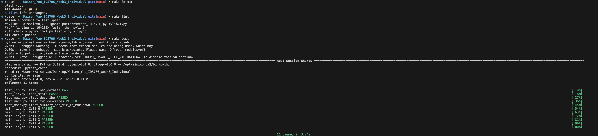

[](https://github.com/kaisenyao/Kaisen_Yao_IDS706_Week3_Individual/actions/workflows/install.yml)
[](https://github.com/kaisenyao/Kaisen_Yao_IDS706_Week3_Individual/actions/workflows/format.yml)
[](https://github.com/kaisenyao/Kaisen_Yao_IDS706_Week3_Individual/actions/workflows/lint.yml)
[](https://github.com/kaisenyao/Kaisen_Yao_IDS706_Week3_Individual/actions/workflows/test.yml)
## Project #1: Continuous Integration using Gitlab Actions of Python Data Science Project

## Youtube Video Link
[Youtube Link](https://youtu.be/pkq37HpXZNg)

### Directory Tree Structure 
```
Kaisen_Yao_IDS706_Week3_Individual/
├── .devcontainer/
│   ├── devcontainer.json
│   └── Dockerfile
├── .github/
│   └── workflows/
│       ├── format.yml
│       ├── install.yml
│       ├── lint.yml
│       └── test.yml
├── .gitignore
├── Dockerfile
├── LICENSE
├── main.ipynb
├── main.py
├── Makefile
├── mylib/
│   ├── __init__.py
│   └── lib.py
├── README.md
├── repeat.sh
├── requirements.txt
├── setup.sh
├── test_lib.py
└── test_main.py
```
### Purpose of Project
The purpose of this project is to build upon the last three mini-projects to simulate best practices of continuous integration in Data Science projects. The project uses a dataset that provides an urbanization index for U.S. congressional districts. It contains details like urbanization index, rural and urban population distributions, and partisan lean.

## Preparation 
1. Open codespaces 
2. Wait for container to be built and pinned requirements from `requirements.txt` to be installed 
3. If running locally, `git clone` the repository and use `make install`

## Check format and test errors
1. Format code `make format`
2. Lint code `make lint`
3. Test code `make test`



## Descriptive statistics and vizualizations
Whenever code is pushed to the repository, the following will be automatically generated and committed via GitHub Actions:
1. Descriptive statistics of the dataset.
2. Visualizations, including:
* Urbanization Index Distribution (Histogram)
* Urbanization Grouping Over Time (Line Chart)
* Population Distribution by District Type (Bar Chart)

The descriptive statistics and vizualizations are generated whenever an individaul pushes to my repository via `actions-user` using `make generate_and_push`. You can find them here [descriptive statistics and vizualizations](/summary.md)

## References 
1. https://github.com/nogibjj/python-ruff-template
2. https://github.com/fivethirtyeight/data